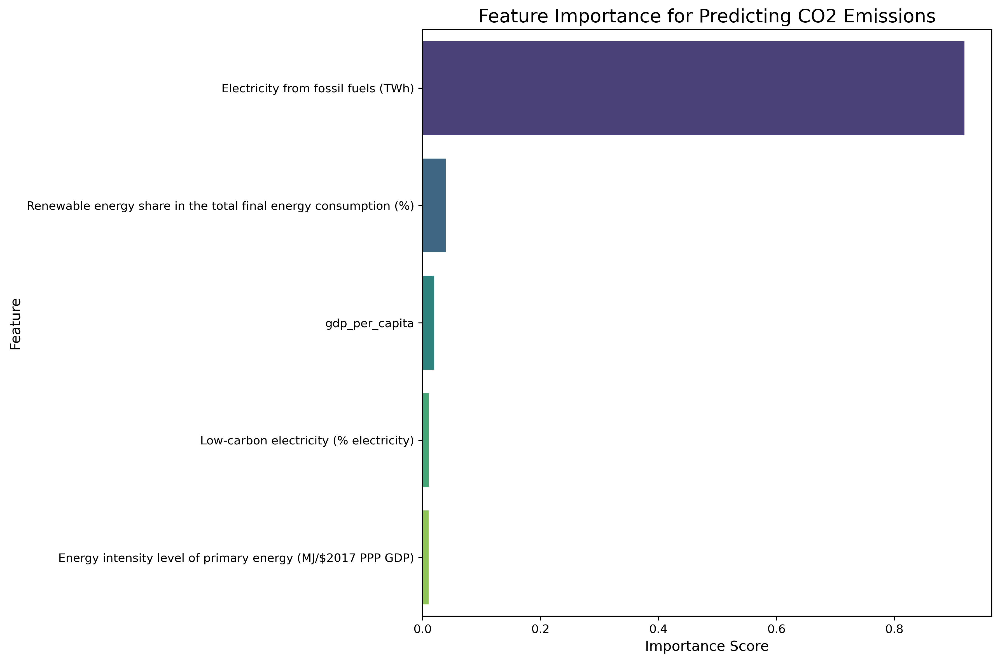
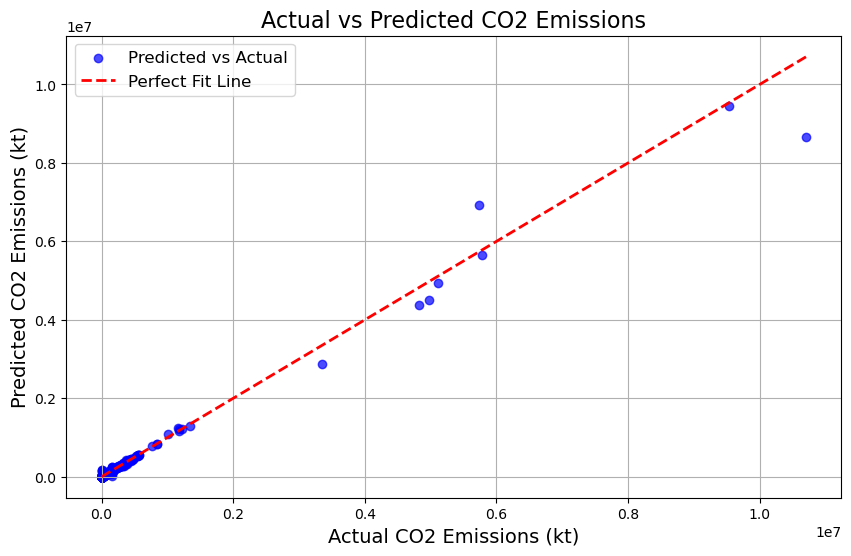

<h1 align="center">Sustainable Energy and CO2 Emissions Analysis 🌱</h1>

<p align="justify">
This project explores the relationships between energy usage, CO2 emissions, and renewable energy adoption using data analysis and visualization. By leveraging machine learning techniques, the analysis identifies key factors influencing CO2 emissions and highlights opportunities for sustainable energy improvements.
</p>

<p align="justify">
The project demonstrates skills in:
</p>

<ul>
    <li>Data Cleaning and Preparation</li>
    <li>Time-Series Analysis and Forecasting</li>
    <li>Feature Importance Analysis</li>
    <li>Visualization of Insights</li>
</ul>

---

## 🔍 Key Insights

<p align="justify">
  
- <b>Feature Importance Analysis</b>: Electricity from fossil fuels is the most significant predictor of CO2 emissions.<br>
  
- <b>High CO2 Emitters</b>: Countries like the United States and China have high fossil fuel usage and low renewable energy adoption.<be>

- <b>Top Renewable Energy Countries</b>: Ethiopia, Uganda, and Mozambique lead with >90% renewable energy shares.<be>

- <b>Forecasting Trends</b>: Time-series models predict growing CO2 emissions in regions with high energy demand and low renewable investments.
</p>

---

## 📊 Visualizations

<p align="justify">
1. Feature Importance for Predicting CO2 Emissions
</p>
<p align="center">

</p>

<p align="justify">
2. Actual vs Predicted CO2 Emissions
</p>
<p align="center">

</p>

---

## 💻 Interactive Version

<p align="justify">
To explore the fully interactive version of the notebook, visit:  
<a href="https://nbviewer.org/github/PashaArrighi/Sustainability_Analysis/blob/main/sustainable_analysis.ipynb"><b>View the Notebook on NBViewer</b></a>
</p>

<p align="justify">
<b>Note</b>: On NBViewer, some visualizations may appear duplicated due to manual execution of hidden code cells used for debugging purposes in Jupyter Notebook. This does not affect the correctness of the results.
</p>

---

## 🛠 Tools and Technologies

<ul>
    <li><b>Programming Language</b>: Python</li>
    <li><b>Libraries</b>: Pandas, Matplotlib, Seaborn, Scikit-learn</li>
    <li><b>Environment</b>: Jupyter Notebook</li>
</ul>

---

## 🚀 How to Use This Project

<p align="justify">
1. Clone the repository:
</p>

```bash
git clone https://github.com/PashaArrighi/Sustainability_Analysis.git
```

## 🎯 Conclusion
<p align="justify"> This project showcases my analytical skills and ability to derive meaningful insights for sustainable decision-making. I am passionate about applying data-driven solutions in roles such as: </p> <ul> <li><b>Sustainability Analyst</b></li> <li><b>Environmental Analyst</b></li> <li><b>Energy Analyst</b></li> </ul> <p align="justify"> Feel free to connect with me for feedback, collaboration, or opportunities in this exciting field! </p> 
